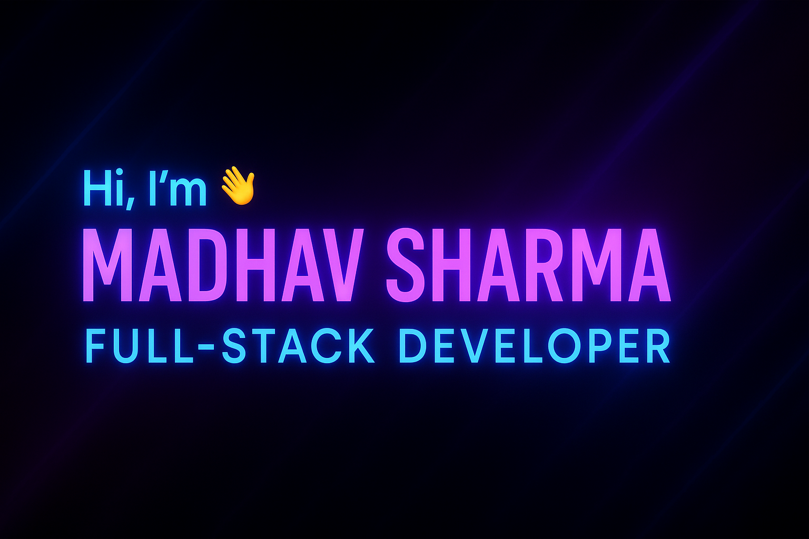

# 📢 Madhav Sharma | @DrMadhavSharma

---

# 🙇‍♂️ About Me

- 🎓 B.Tech in Computer Engineering @ **IKG PTU, Punjab** (2023–2027)
- 💻 Diploma in Programming @ **IIT Madras** (2023–2025)
- 🏆 **4× Topper Badges** at IITM (Python, Statistics-2, English-I)
- 🛠️ Tech-obsessed | Full-Stack | Backend Specialist
- 🚀 Always learning, always building.

---

# 🚀 Tech Stack

  
| Languages | Frameworks/Libraries | Tools/Technologies |
|:---|:---|:---|
| Python, C, C++, SQL, JavaScript, HTML, CSS | Flask, SQLAlchemy, NumPy, Matplotlib, PyTorch (Beginner) | Git, GitHub, VS Code, Jupyter, WSL, MySQL, Postman, Jinja2, Vue.js, React.js |

---

# 🛠 My Projects

- 🔥 [Quiz Master V2](https://github.com/DrMadhavSharma/Quiz-Master-V2) — *(Flask + VueJS + Redis + Celery)*  
  Full-stack exam platform with real-time performance tracking.

- 🛠 [Household Services App](https://github.com/DrMadhavSharma/Household-Services-App) — *(Python + SQLAlchemy + Bootstrap)*  
  Household service booking platform with role-based access control.

---

# 📈 GitHub Analytics

  
   
  
   
  

---

# 🏆 GitHub Trophies

 
  

---

# 📢 Connect With Me

---

# ✨ Random Fun Fact

> 🧠 I believe coding is a superpower — let's create magic together. ⚡

---

# 🔥 Thank you for visiting my profile!

